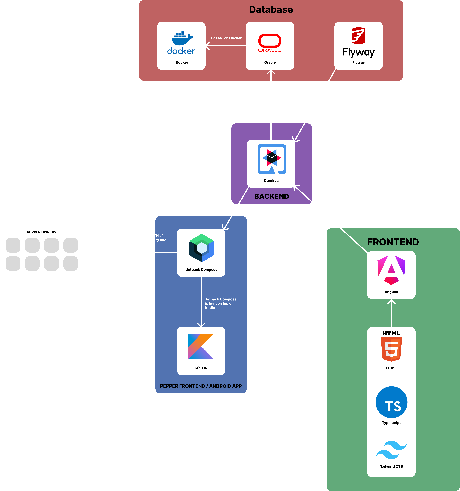
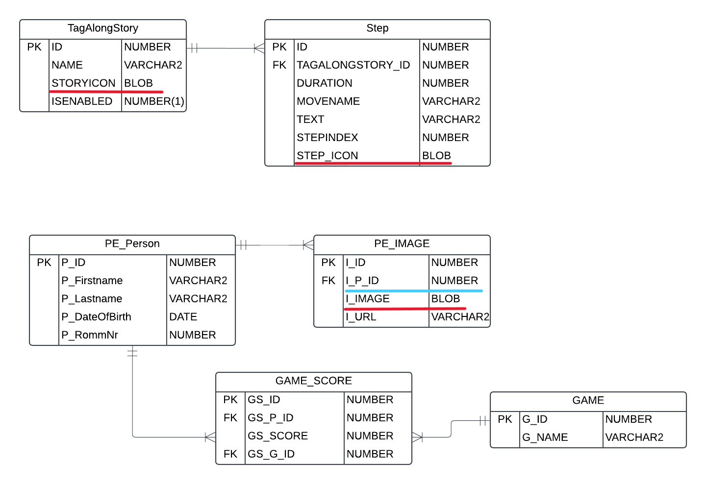

= Pepper in Retirement Homes (Minigames) 🤖🏡
Kyaw, Obaid, Amir, Milad
:toc: right
:toc-title: Table of Contents
:icons: font
:source-highlighter: rouge

== Project Description

*Pepper in Retirement Homes* is an innovative project aimed at enriching and facilitating the lives of seniors in care facilities. Our main actor is the robot Pepper, which offers a variety of interactive games and features to make the seniors' daily lives more enjoyable.

== Verzeichnisse

[%autowidth]
|===
|Verzeichnis |Inhalt

|`backend_v2`
|Das derzeitige Backend

|`PepperAngular`
|Das Legacy-Frontend (System der vorjährigen Schülergruppe)

|`PepperAngularNeu`
|Das neu zu entwickelnde Frontend
|===

== Contributors

- Kyaw
- Obaid
- Amir
- Milad

== 🎮 Games
Pepper offers a selection of games such as Memory (Personalized), Tag along stories, and many more, specifically designed for seniors to stimulate their minds and provide entertainment.

== Tech Stack

- **Kotlin**: For developing games on Pepper
- **Java**: As the programming language for backend
- **Quarkus**: For building efficient and high-performance Backend
- **Jetpack Compose**: For modern UI design and development for Pepper
- **OracleSQL**: For the database
- **Docker**: For containerization of OracleSQL
- **Angular**: For the web application
- **HTML**: For the frontend
- **Tailwind CSS**: For styling the frontend
- **TypeScript**: For the frontend
- **Postman**: For API testing
- **Swagger**: For API documentation
- **Git**: For version control
- **GitHub**: For collaboration and project management
- **YouTrack**: For issue tracking and project management

== System Architecture

== Diagrams

== Test Section

This is a test section added to verify push access.

== github

https://github.com/2425-4chif-syp/01-projekte-2025-4chif-syp-pepper-minigames