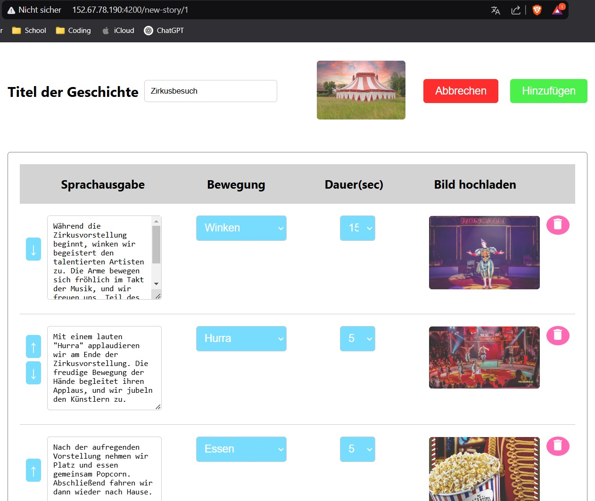

= Besprechungsprotokoll 12.02.2025

Milad Moradi

== Protokoll des Gesprächs mit Herrn Professor Bauer und Herrn Professor Stütz

.Teilnehmer
|===
|Anwesend |Verteiler

|Thomas Stütz 
|

|Petter Bauer
|

|Amir Mohamadi
|

|Milad Moradi
|

|Obaidullah Mustaq
|

|Kyaw Thet Htun
|
|===

.Ort und Zeit
[cols=2*]
|===
|Ort
|HTL-Leonding

|Von-Bis
|Mittwoch . 12.02.2025,

|Dauer
|100 min
|2. und 3. EH
|===

== Besprochene Punkte

=== 1. Musik bei Mitmachgeschichten

Musik soll parallel zur Mitmachgeschichte abgespielt werden.

Abstimmung der Musik mit den Geschichten.

Technische Umsetzung und Steuerung.

=== 2. Gästeverwaltung

Liste aller Gäste, die ausgelesen werden kann.

Steuerungsmöglichkeiten für die Gäste.

=== 3. Bewegungssteuerung

Eigene Bewegungen für die Roboter definieren.

Eine Person aus der Gruppe kümmert sich darum.

=== 4. Inhalte auf beiden Robotern

Alle Inhalte sollen auf beiden Robotern laufen.

Technische Voraussetzungen zur Umsetzung.

== Anhänge

[Hier können die Screenshots eingefügt werden]

=== Mitmachgeschichten-Auswahl

=== Mitmachgeschichten-Editieren

=== Initialisierung der Datenbank

=== Add-Get-TagALongStories

=== Get-All-TagAlongStories

=== Delete-Update-TagALongStories
image::images/Delete-Update-TagALongStories.jpeg[Delete-Update-TagALongStories]

