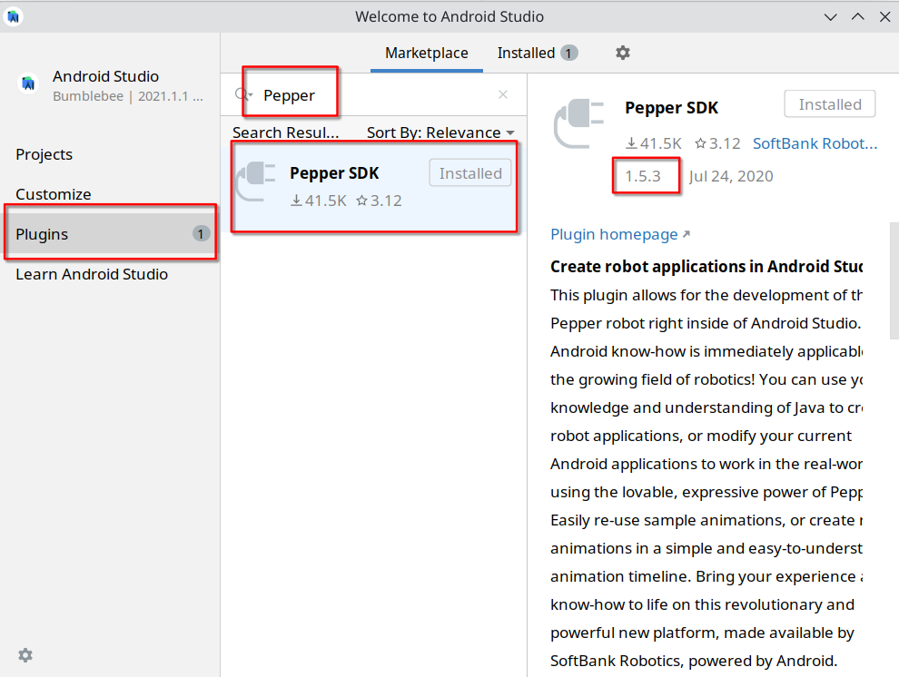
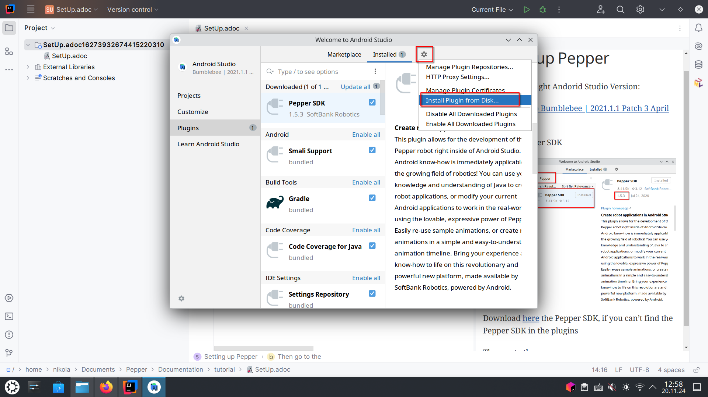
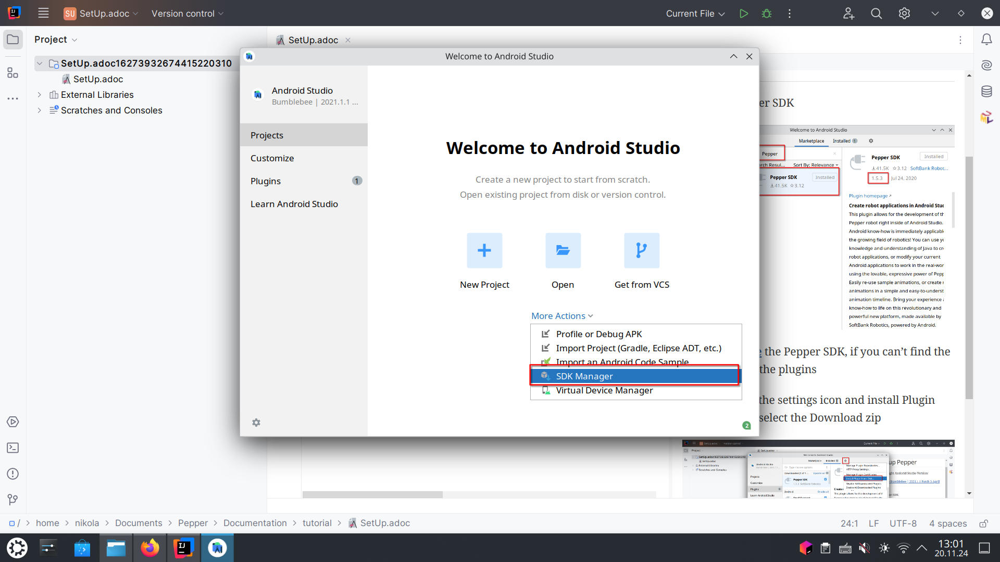
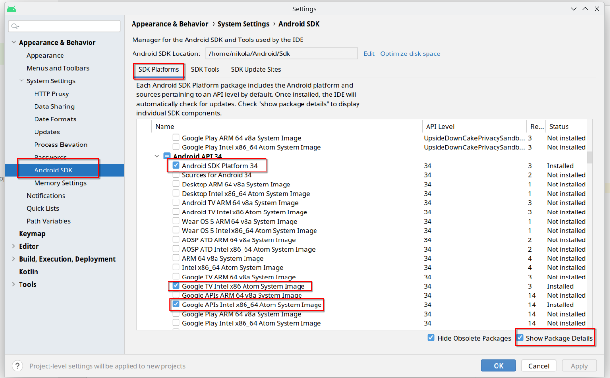
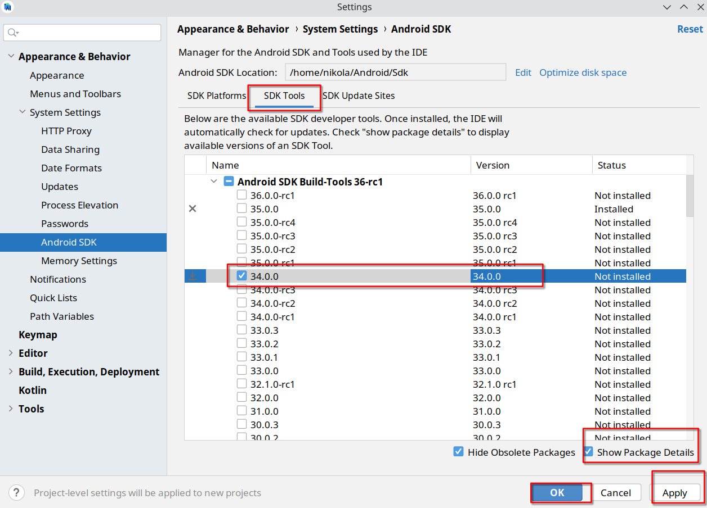

= Setting up Pepper

[note]
======
You can use windows, but Linux is better
======

* Install the right Andorid Studio Version:

Windows:

link:https://redirector.gvt1.com/edgedl/android/studio/install/2021.1.1.23/android-studio-2021.1.1.23-windows.exe[Android Studio Bumblebee | 2021.1.1 Patch 3 April 7, 2022]

Linux:

link:https://redirector.gvt1.com/edgedl/android/studio/ide-zips/2021.1.1.23/android-studio-2021.1.1.23-linux.tar.gz[Android Studio Bumblebee | 2021.1.1 Patch 3 April 7,2022]

---

* Install Pepper SDK

Download link:https://plugins.jetbrains.com/plugin/download?rel=true&updateId=92773[here]
the Pepper SDK, if you can't find the Pepper SDK in the plugins

Then go to the settings icon and install Plugin from Disk and select the Download zip

---

* Install correct Android SDK

Now you are ready to create a pepper project