= Create a application from scratch

[note]
====
Hint: When chainging someting in Gradle always sync you project
====

* Open Android Studio and select New Project

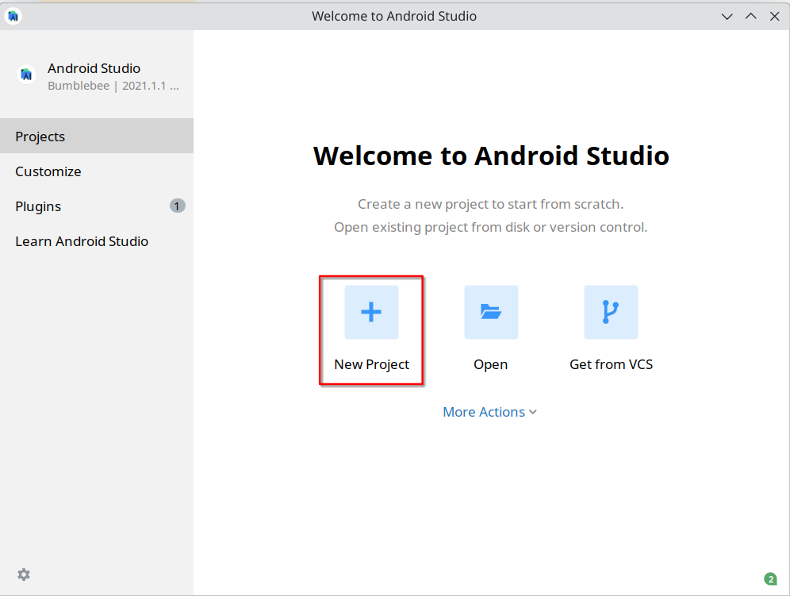

* Select Empty Compose Activity

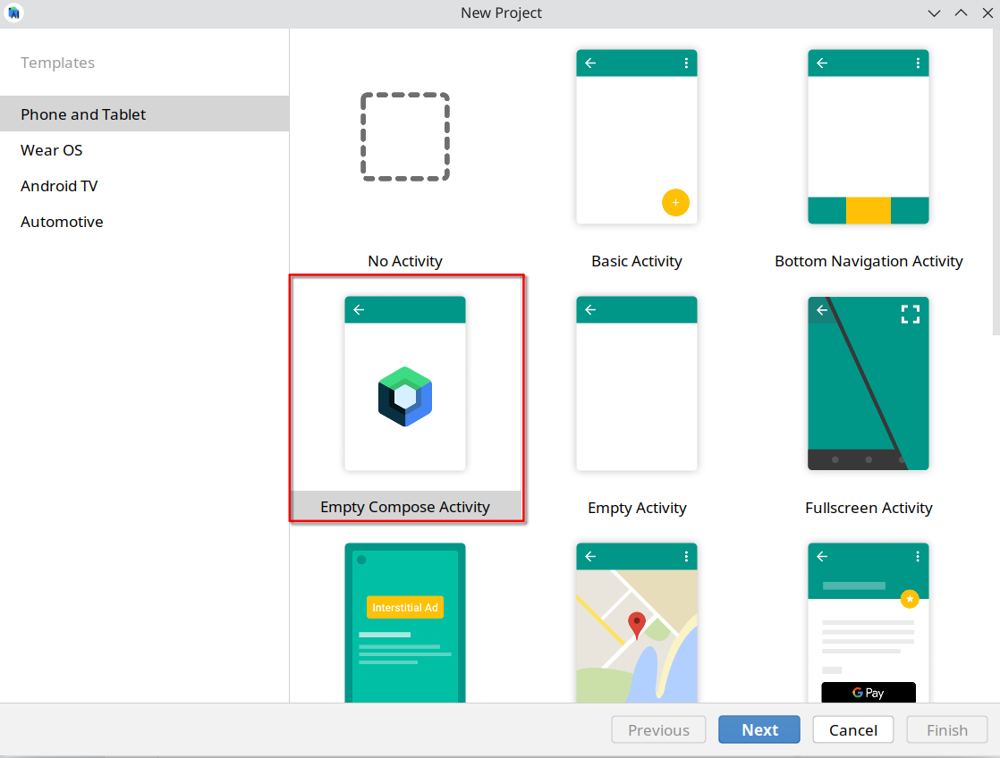

* Select Minimum SDK to **API23: Android 6.0 (Marshmallow)**

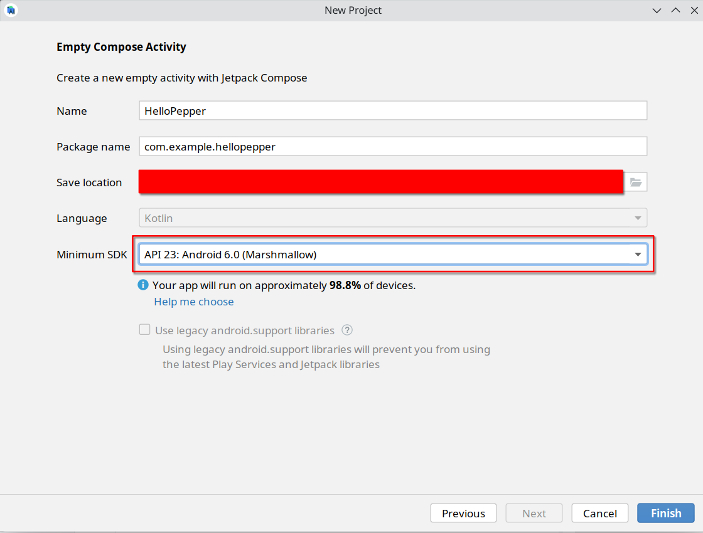


* Select **File** > **New** > **Robot Application**

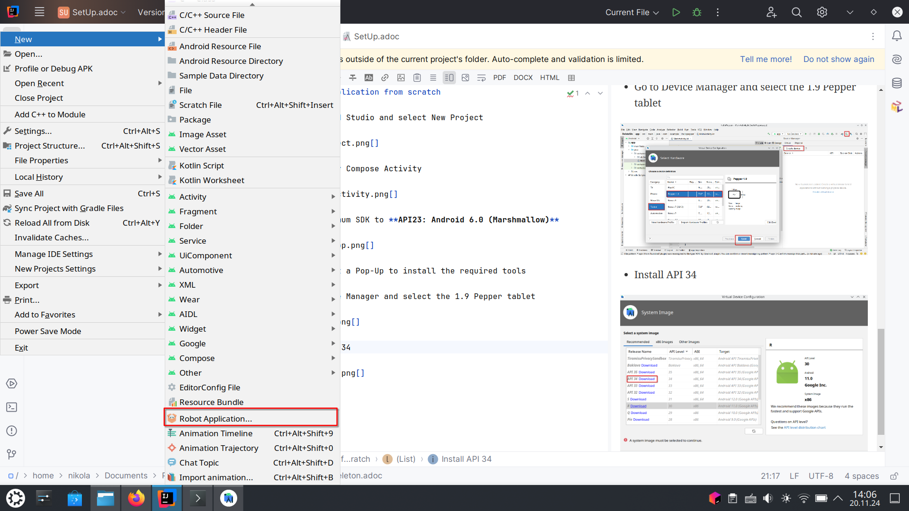

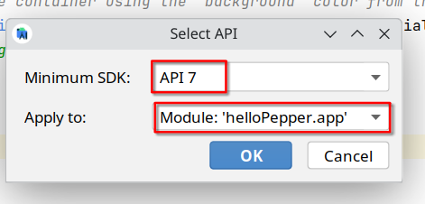

* Go to **Gradle Scripts** > **build.gradle(Module: xy.app)** add this code snippet

```
implementation 'com.aldebaran:qisdk:1.7.5'
implementation 'com.aldebaran:qisdk-design:1.7.5'

```

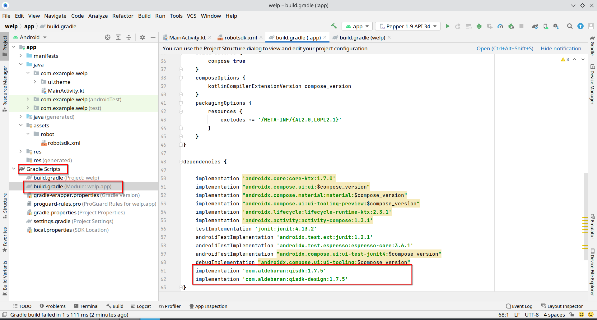

* Execute **Build** > ** Make Project**

* Errors will show up

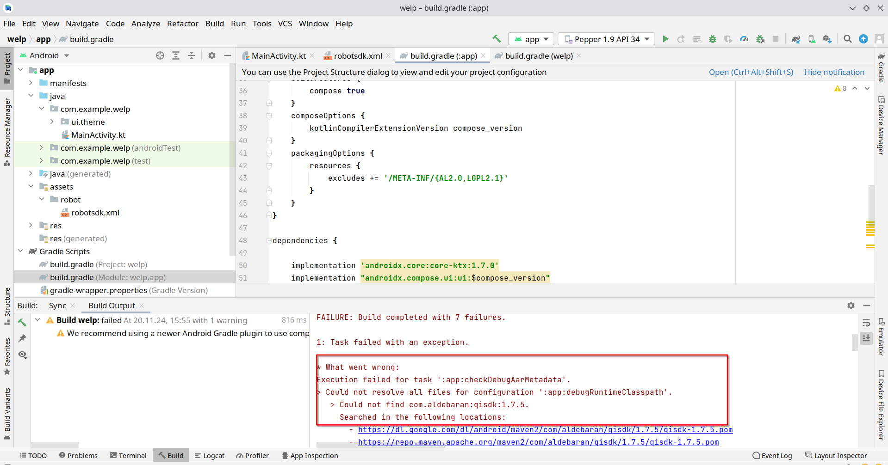

* Add this code snippet to your gradle

```
maven {

url 'http://android.aldebaran.com/sdk/maven'
allowInsecureProtocol = true

}
```

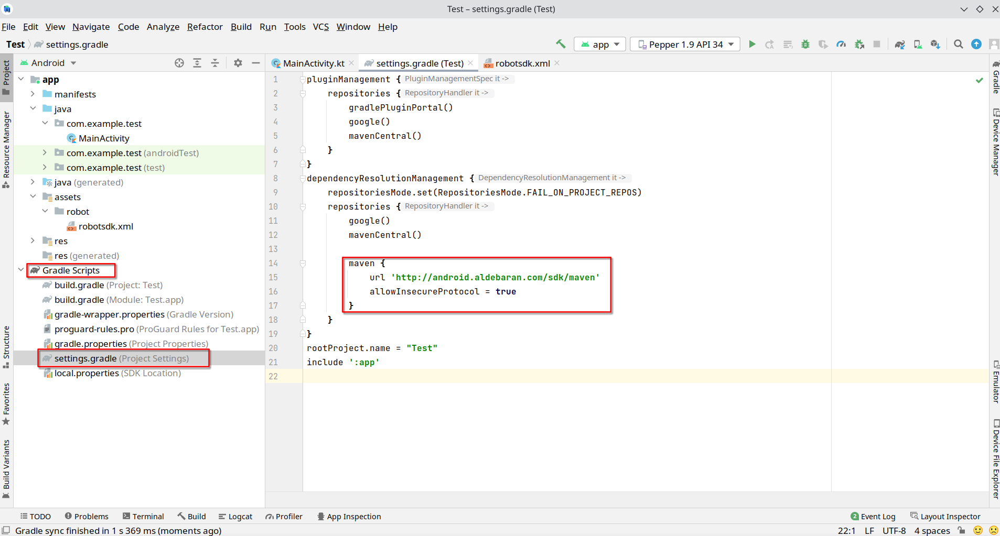

* Android Studio will restart automatically


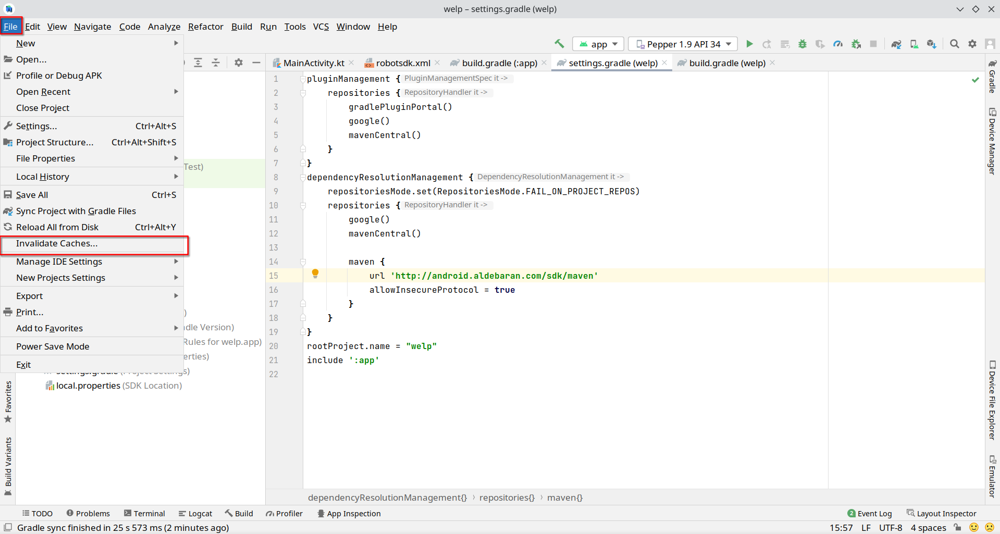

* Add this code snippet to your gradle

```
android.enableJetifier=true
```

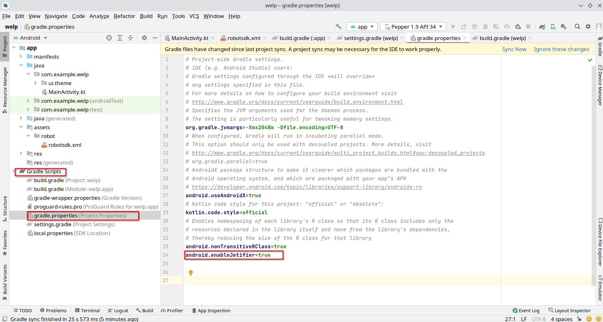

====
---
====


* Change your MainActivity with this code snippet

- Pepper displays Hello Pepper on the tablet

```
import android.os.Bundle
import androidx.activity.ComponentActivity
import androidx.activity.compose.setContent
import androidx.compose.foundation.layout.Column
import androidx.compose.foundation.layout.fillMaxSize
import androidx.compose.material.MaterialTheme
import androidx.compose.material.Surface
import androidx.compose.material.Text
import androidx.compose.runtime.Composable
import androidx.compose.ui.Modifier
import androidx.compose.ui.tooling.preview.Preview
import com.aldebaran.qi.sdk.QiContext
import com.aldebaran.qi.sdk.QiSDK
import com.aldebaran.qi.sdk.RobotLifecycleCallbacks
import com.aldebaran.qi.sdk.design.activity.RobotActivity

class MainActivity : ComponentActivity(), RobotLifecycleCallbacks {

    override fun onCreate(savedInstanceState: Bundle?) {
        super.onCreate(savedInstanceState)
        // Register the RobotLifecycleCallbacks to this Activity.
        QiSDK.register(this, this)
        setContent{
            Column() {
                Text("Hello Pepper")
            }
        }
    }
    override fun onDestroy() {
        // Unregister the RobotLifecycleCallbacks for this Activity.
        QiSDK.unregister(this, this)
        super.onDestroy()
    }
    override fun onRobotFocusGained(qiContext: QiContext) {
        // The robot focus is gained.
    }
    override fun onRobotFocusLost() {
        // The robot focus is lost.
    }
    override fun onRobotFocusRefused(reason: String) {
        // The robot focus is refused.
    }
}
```

* Now you can deploy under **Tools** > **Pepper SDK** > **Connect**

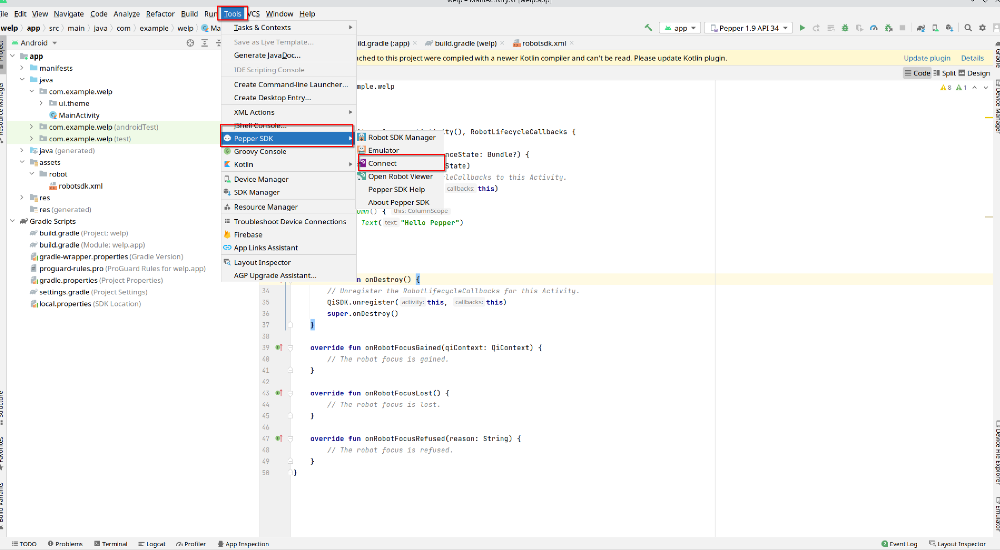

---

* To emulate the tablet and pepper you can use **Tools** > **Pepper SDK** > **Emulator**